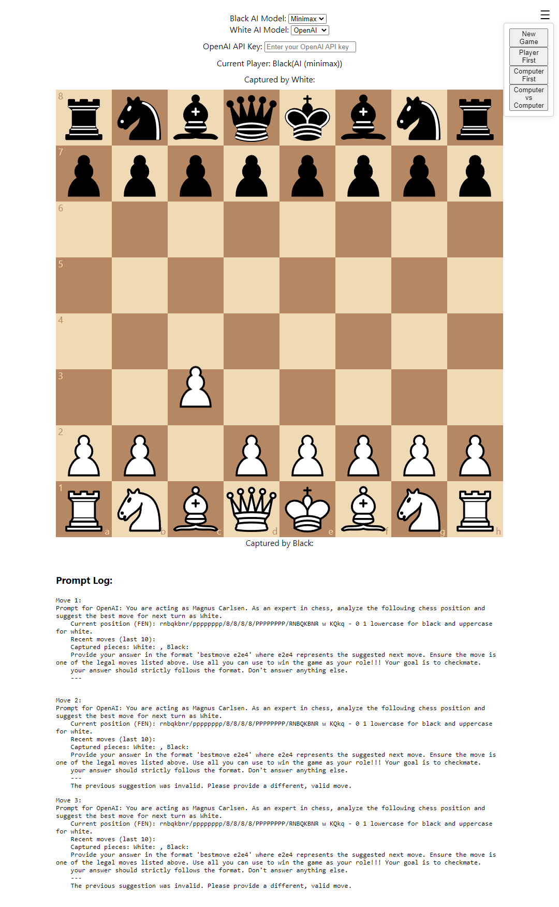

# AI Chess React.js



## Table of Contents

- [AI Chess React.js](#ai-chess-reactjs)
  - [Table of Contents](#table-of-contents)
  - [Introduction](#introduction)
  - [Features](#features)
  - [Technologies Used](#technologies-used)
  - [Installation](#installation)
  - [Usage](#usage)
  - [AI Models](#ai-models)
    - [Minimax](#minimax)
    - [A\* (A-star)](#a-a-star)
    - [OpenAI](#openai)
  - [Components](#components)
    - [ChessGame](#chessgame)
    - [BurgerMenu](#burgermenu)
    - [AIModelSelector](#aimodelselector)
    - [Toast](#toast)
  - [Game Modes](#game-modes)
  - [Configuration](#configuration)
  - [Contributing](#contributing)

## Introduction

This AI Chess Application is a sophisticated web-based chess game that allows users to play against various AI opponents or watch AI vs AI matches. The application leverages different AI models and algorithms to provide a challenging and educational chess experience.

## Features

- Interactive chessboard with drag-and-drop functionality
- Multiple game modes: Player vs AI, AI vs AI
- Various AI models: Minimax, A\*, and OpenAI
- Adjustable AI difficulty levels
- Real-time game status updates
- Captured pieces display
- Move history logging
- Responsive design for different screen sizes
- Burger menu for quick access to game options
- Toast notifications for important game events

## Technologies Used

- React.js
- chess.js
- react-chessboard
- Web Workers for AI processing
- OpenAI API (optional)

## Installation

1. Clone the repository:

   ```
   git clone https://github.com/yourusername/ai-chess-application.git
   ```

2. Navigate to the project directory:

   ```
   cd ai-chess-application
   ```

3. Install dependencies:

   ```
   npm install
   ```

4. Start the development server:
   ```
   npm start
   ```

## Usage

1. Open the application in your web browser.
2. Use the burger menu to select a game mode.
3. Choose AI models for each player (if applicable).
4. Start the game and make moves by dragging and dropping pieces.
5. Watch the AI respond with its moves.
6. Use the reset option in the burger menu to start a new game.

## AI Models

### Minimax

- Implementation: `chessLogic.js`
- Description: A depth-first search algorithm that evaluates future game states.
- Configuration: Adjust the `depth` parameter in `ChessGame.js` to change difficulty.

### A\* (A-star)

- Implementation: `astarChess.js`
- Description: A best-first search algorithm using heuristics to evaluate moves.
- Configuration: Modify the `depth` and `heuristicWeight` in `ChessGame.js`.

### OpenAI

- Implementation: `openAIBot.js`
- Description: Utilizes OpenAI's language models to generate chess moves.
- Configuration: Requires an OpenAI API key. Set the key in the UI or as an environment variable.

## Components

### ChessGame

- Main component that manages the game state and AI interactions.
- Handles user interactions and updates the game board.

### BurgerMenu

- Provides options for resetting the game and changing game modes.

### AIModelSelector

- Allows users to choose AI models for each player.

### Toast

- Displays notifications for important game events.

## Game Modes

1. Player First: Human plays as White, AI as Black.
2. Computer First: AI plays as White, Human as Black.
3. Computer vs Computer: Two AI players compete against each other.

## Configuration

- AI model selection: Modify the `aiModels` state in `ChessGame.js`.
- Board size: Adjust the `boardSize` state for different screen sizes.
- AI thinking time: Change the timeout in the `useEffect` hook in `ChessGame.js`.

## Contributing

1. Fork the repository.
2. Create a new branch for your feature: `git checkout -b feature-name`.
3. Make your changes and commit them: `git commit -m 'Add some feature'`.
4. Push to your fork: `git push origin feature-name`.
5. Create a pull request describing your changes.
